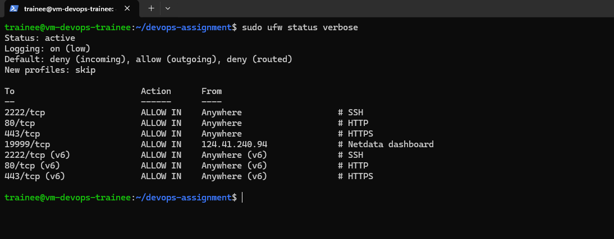
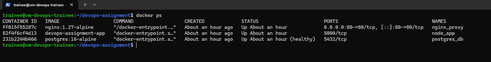
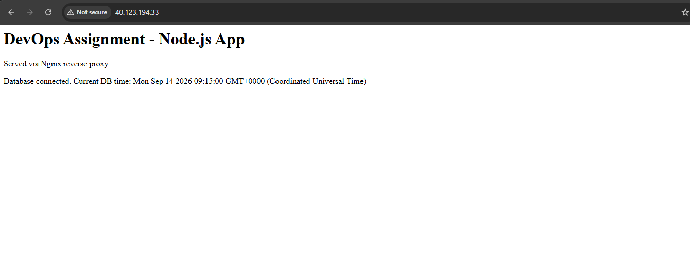
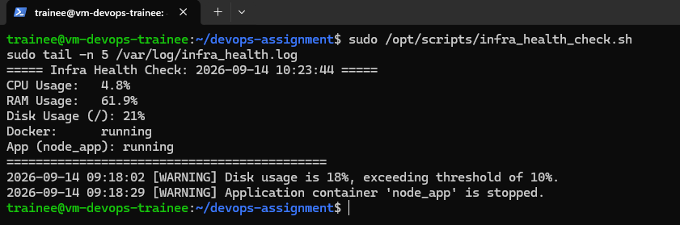
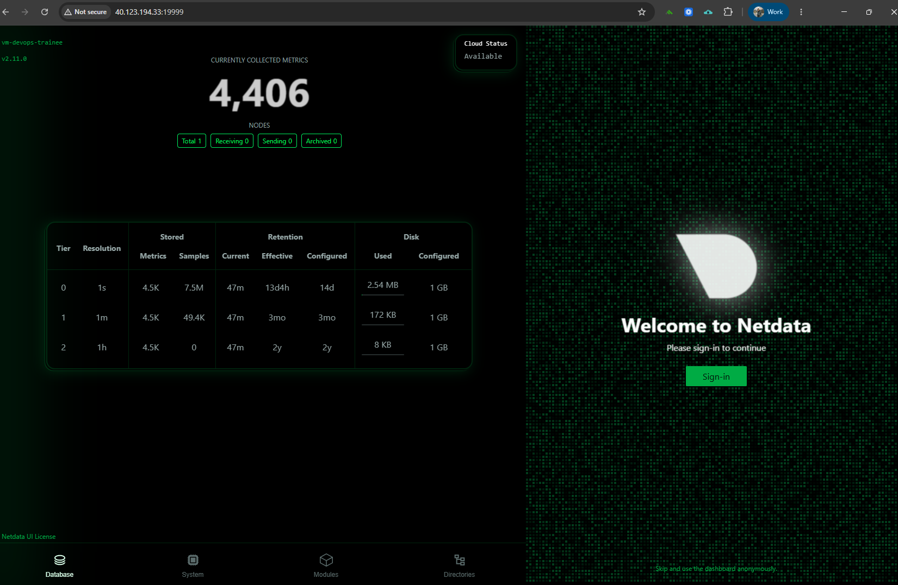

# DevOps Trainee — Practical Implementation Assignment

End-to-end infrastructure on an Azure Ubuntu 24.04 VM: Linux hardening, a Dockerized multi-service web stack (Nginx → Node.js → PostgreSQL), automation scripting with cron, database backup/restore, and monitoring with Netdata.

## Architecture

# DevOps Trainee — Practical Implementation Assignment

End-to-end infrastructure on an Azure Ubuntu 24.04 VM: Linux hardening, a Dockerized multi-service web stack (Nginx → Node.js → PostgreSQL), automation scripting with cron, database backup/restore, and monitoring with Netdata.

## Architecture

Internet -> Azure NSG (2222, 80, 443) -> ufw -> VM
|
+--------+--------+
| Docker |
Browser :80 -> nginx_proxy -> node_app :5000 -> postgres_db :5432
| (pgdata volume) |
+---------------------------+


- **nginx_proxy** — reverse proxy, the only service published to the host (port 80).
- **node_app** — Express app on internal port 5000, reachable only via Nginx.
- **postgres_db** — PostgreSQL 16 with a named volume `pgdata` for persistence.

## Prerequisites

- Azure VM, Ubuntu 24.04 LTS
- Docker Engine + Docker Compose plugin
- A `.env` file (see `.env.example`) holding DB credentials — never committed

## Setup

```bash
git clone https://github.com/Bibyek/devops-assignment.git
cd devops-assignment

# Create the environment file from the template, then set a strong password
cp .env.example .env

# Bring the stack up
docker compose up -d --build

# Verify
docker compose ps
curl http://localhost/
```

## Teardown

```bash
# Stop and remove containers + network (keeps the data volume)
docker compose down

# Full teardown INCLUDING the database volume (destroys data)
docker compose down -v
```

## Task 1 — System Security & Linux

- Dedicated user `trainee` with sudo privileges.
- SSH hardened via `/etc/ssh/sshd_config.d/99-hardening.conf`: `Port 2222`, `PermitRootLogin no`, `PasswordAuthentication no` (key-based auth only).
- Ubuntu 24.04 socket activation (`ssh.socket`) disabled so the port change takes effect.
- `ufw` active, allowing only 2222 (SSH), 80 (HTTP), 443 (HTTPS).

Verify firewall:
```bash
sudo ufw status verbose
```


## Task 2 — Containerization & Web Services

Three services in `docker-compose.yml`. Nginx reverse-proxies `/` to the Node app, which queries PostgreSQL.

Verify containers:
```bash
docker ps
```


Verify reverse proxy routing:
```bash
curl http://localhost/
# or browser: http://<server-ip>/
```


## Task 3 — Automation & Shell Scripting

`scripts/infra_health_check.sh` (deployed to `/opt/scripts/`) checks CPU, RAM, and root disk usage, verifies Docker and the `node_app` container, and on disk >85% or a stopped container prints a `[WARNING]` and appends a timestamped entry to `/var/log/infra_health.log`.

Cron (`/etc/cron.d/infra_health_check`) runs it every 15 minutes:

*/15 * * * * root /opt/scripts/infra_health_check.sh >> /var/log/infra_health_cron.log 2>&1


Run manually:
```bash
sudo /opt/scripts/infra_health_check.sh
sudo tail -n 5 /var/log/infra_health.log
```


## Task 4 — Monitoring, Backups & Disaster Recovery

Backup — `scripts/db_backup.sh` (deployed to `/opt/scripts/`) runs `pg_dump` inside the container, gzips it, and stores it as `/var/backups/db/db_backup_YYYYMMDD.sql.gz`. Retention: last 7 daily backups.

```bash
sudo /opt/scripts/db_backup.sh
ls -lh /var/backups/db/
```

Restore — decompress and pipe into `psql` inside the container:
```bash
zcat /var/backups/db/db_backup_YYYYMMDD.sql.gz | docker exec -i postgres_db psql -U appuser -d appdb
```

> The assignment's format string specifies `db_backup_YYYYMMDD.sql.gz`. For a single-database dump, `pg_dump | gzip` (a gzipped SQL file) is the correct standard artifact, so `.sql.gz` is used.

Monitoring — Netdata (`http://<server-ip>:19999`) auto-discovers Docker containers via cgroups, providing both system-wide and per-container metrics on a low-footprint agent suited to a 1 GiB VM.


## Task 5 — Git & Documentation

Feature-branch workflow, each merged into `main`:
- `feature/docker-setup` — compose stack, Nginx, app, Postgres
- `feature/scripts` — health check + backup scripts and cron
- `feature/docs` — this runbook

## Security Notes

- `.env` (DB credentials) is gitignored and never committed.
- SSH is key-only on a non-default port; root login disabled.
- The app and database are not published to the host — only Nginx (port 80) is externally reachable.
- The Netdata dashboard port (19999) is restricted to a single admin IP in both the NSG and ufw.
